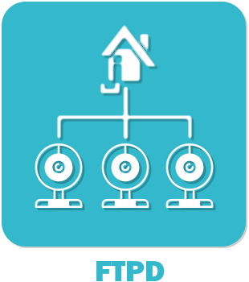

# Plugin ftpd pour Jeedom

Plugin permettant de récupérer les fichiers envoyé par ftp et d'avoir la remonté d'information de dépot lorsque quelque chose est déposé.

### Market

Retrouvez le sur le Market Jeedom [ici](https://www.jeedom.com/market/index.php?v=d&p=market&type=plugin&name=ftpd)

### Documentation

Vous trouverez la documentation [ici](https://github.com/Jeedom-Plugins-Extra/ftpd/blob/stable/docs/fr_FR/index.md)

### Prévisualisation

### Forum

Lien vers le forum [ici](https://www.jeedom.com/forum/viewtopic.php?f=134&t=24684)

### Chatroom

Lien vers le chat [ici](https://gitter.im/Jeedom-Plugins-Extra/plugin-ftpd)

### Fonctions disponibles

Infos :
* Etat
* Nom du dernier fichier
* Notification
* Status d enregistrement

Actions :
* Bascule notification
* Active notification
* Désactive notification
* Arrêter l enregistrement
* Démarrer l enregistrement

Scénarios possible (ceux que j'ai chez moi) :
* ?????

## <a href="https://creativecommons.org/licenses/by-sa/4.0/"> Team Jeedom-Plugins-Extra </a> 👍
### Retour à l'accueil du [Wiki](https://github.com/Jeedom-Plugins-Extra/Jeedom-Plugins-Extra/wiki) ou de la [Team](https://github.com/Jeedom-Plugins-Extra)
