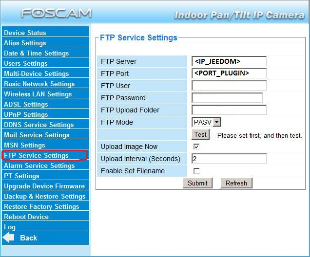
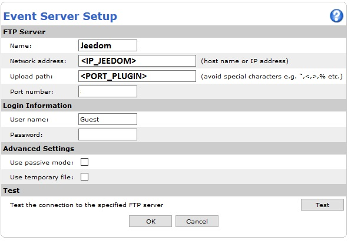
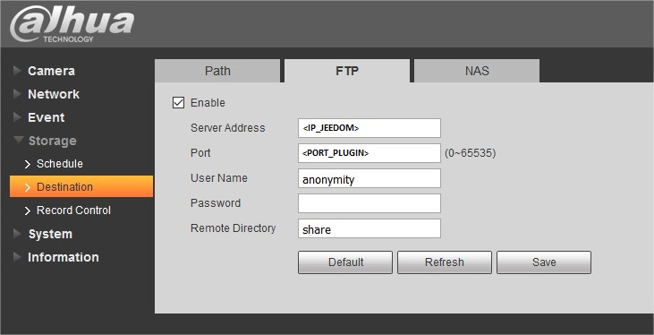
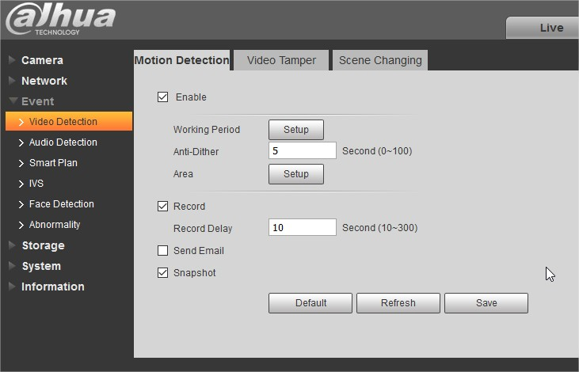
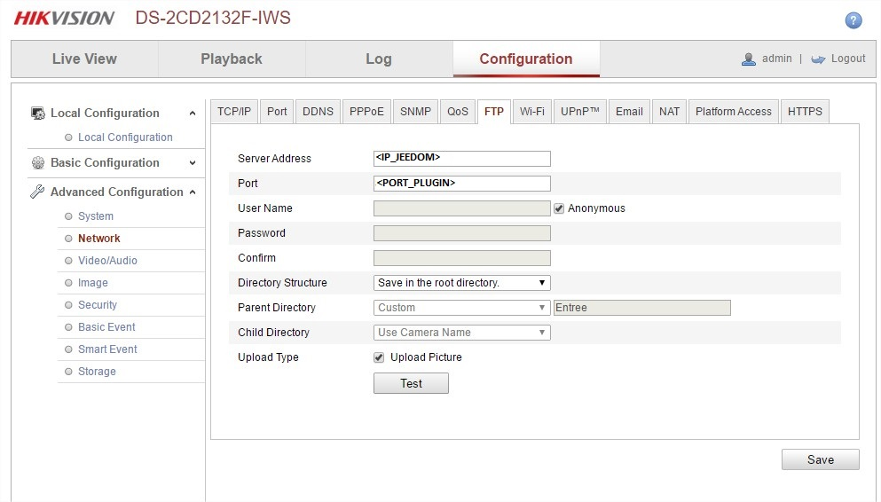
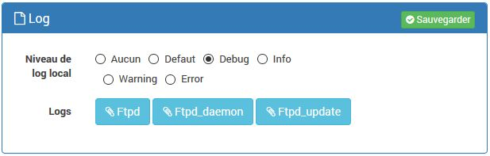

# Configuration

### Installation/Configuration

Nous allons configurer le plugin. Pour se faire, cliquer sur **Plugin /
Gestion des plugins**. Puis trouver **Ftpd**.

Il faut définir certains paramètres global au plugin :

-   Port Ftpd : Port sur lequel le daemon écoutera pour les fichiers.

-   Local IP : Adresse ip d'écoute du daemon. Il est préférable de
    laisser 0.0.0.0.

-   IP Autorisées : Liste les IPs autorisées à déposer des fichiers.

    Format : liste séparé par virgule sans espace. La liste peut
    contenir des ips (192.168.1.1), des masques ( (192.168.1.0/32) ou
    des plages (192.168.1.1-192.168.1.12).

-   Chemin des enregistrements : Chemin dans lequel les fichiers
    seront stockés.

-   Debug daemon : Permet d’activer le debug du daemon Ftpd.

Et pour finir, cliquer sur Sauvegarder.

### Fonctionnement :

Le plugin créera automatiquement les équipements une fois qu’ils auront
envoyé un fichier.

### Informations visibles :

-   **Etat** : état du Ftpd. C’est une commande de type info binary.
    Elle est active durant 10 secondes sur reception de fichier.

-   **Nom du dernier fichier** : Nom de la dernière capture reçue.

-   **Notification** : Etat de notification.

-   **Status d enregistrement** : Etat de l'enregistrement des fichiers.
Permet de désactiver l'enregistrement des fichiers temporairement sans modifier le paramétrage de la camera.

### Actions visibles :

-   ** Bascule notification**

-   ** Active notification**

-   ** Désactive notification**

-   ** Arrêter l enregistrement**

-   ** Démarrer l enregistrement**

Configuration
-------------

Nous allons maintenant paramétrer l'équipement. Pour se faire, cliquer
sur **Plugins / Sécurité / Ftpd**

Puis définir les caractèristiques :

-   Objet parent

-   Catégorie (optionnelle)

-   Activer (coché par défaut)

-   Visible (optionel si vous ne désirez pas le rendre visible sur
    le Dashboard)

-   Nombre max de fichier : Nombre de fichier maximum conservés.

Et pour finir, cliquer sur Sauvegarder

Chaque camera possède des commandes pour activer ou non l’enregistrement
des fichiers.

Chaque camera possède des commandes pour activer ou non la notification
par mail. Pour que celle-ci fonctionne il faut configurer le plugin mail
et ajouter l'équipement "mail" dans la commande "notification".

Il est possible de rajouter des commandes types pattern pour distinguer
les déclanchements en fonction du nom du fichier. [Doc php
pattern](http://php.net/manual/fr/function.preg-match.php)

Par exemple, avec ce qui suit, la commande ne se active que si le
fichier commence par def.

/^def/&lt;/programlisting&gt;

Gestion des notifications
-------------------------

Il est tout d'abord possible de gérer les notifications via scenario provoqué sur la commande etat.

Mais il est aussi possible pour chaque camera de gérer des notifications via la commande notification.
Dans ce cas dans Notification il faut positionner la commande de notification (Email, SMS, ...).
Il faut aussi activer les notifications via la commande "Notification On".

### Configuration Foscam

Il faut se connecter en http sur la camera et aller dans le menu FTP
Service Settings.

Voici une copie d'écran de ce qu’il faut paramétrer :

&lt;IP\_JEEDOM&gt; Correspond à l’adresse IP de votre jeedom.

&lt;PORT\_PLUGIN&gt; Correspond au port Ftpd qui a été renseigné dans la
page de configuration du plugin (8888 par defaut).

Il n’est pas nécessaire de renseigner de compte, de mot de passe, ni de
répertoire.

Il faut ensuite aller dans le menu Alarm Service Settings pour définir
quand envoyer des images.

### Configuration Wanscam

Il faut se connecter en http sur la camera et aller dans le menu FTP
Service Settings.

Voici une copie d'écran de ce qu’il faut paramétrer :

&lt;IP\_JEEDOM&gt; Correspond à l’adresse IP de votre jeedom.

&lt;PORT\_PLUGIN&gt; Correspond au port Ftpd qui a été renseigné dans la
page de configuration du plugin (8888 par defaut).

Il n’est pas nécessaire de renseigner de compte, de mot de passe, ni de
répertoire.

Il faut ensuite aller dans le menu Alarm Service Settings pour définir
quand envoyer des images.

### Configuration Axis

Il faut se connecter en http sur la camera et aller dans le menu Event ⇒
Event servers ⇒ Add FTP.

Voici une copie d'écran de ce qu’il faut paramétrer :

&lt;IP\_JEEDOM&gt; Correspond à l’adresse IP de votre jeedom.

&lt;PORT\_PLUGIN&gt; Correspond au port Ftpd qui a été renseigné dans la
page de configuration du plugin (8888 par defaut).

Il n’est pas nécessaire de renseigner de compte, de mot de passe, ni de
répertoire.

Il faut ensuite aller dans le menu Alarm Service Settings pour définir
quand envoyer des images.

### Configuration Escam (chinoises sur soc Hisilicon)

Il faut se connecter en http sur la camera et aller dans le menu Install
⇒ SYSTEME ⇒ Serv. d’reseau ⇒ FTP

Voici une copie d'écran de ce qu’il faut paramétrer :

&lt;IP\_JEEDOM&gt; Correspond à l’adresse IP de votre jeedom.

&lt;PORT\_PLUGIN&gt; Correspond au port Ftpd qui a été renseigné dans la
page de configuration du plugin (8888 par defaut).

Il n’est pas nécessaire de renseigner de compte, de mot de passe, ni de
répertoire.

Il faut ensuite aller dans le menu Centre d’alarm pour définir quand
envoyer des images.

### Configuration Dahua

Il faut se connecter en http sur la camera et aller dans le menu Storage
⇒ Destination ⇒ FTP.

Voici une copie d'écran de ce qu’il faut paramétrer :

&lt;IP\_JEEDOM&gt; Correspond à l’adresse IP de votre jeedom.

&lt;PORT\_PLUGIN&gt; Correspond au port Ftpd qui a été renseigné dans la
page de configuration du plugin (8888 par defaut).

Il n’est pas nécessaire de renseigner de User Name, Password, ni Remote
Directory.

Il faut ensuite aller dans le menu Storage ⇒ Destination ⇒ Path pour
activer l’envoi de photo en cas de Motion Detection (detection de
mouvement) pour définir quand envoyer des images.

Enfin, il faut aller dans le menu Event ⇒ Video Detection ⇒ Motion
Detection pour configurer les critères de Motion Detection (detection de
mouvement).

### Configuration Vivotek

Il faut se connecter en http sur la camera et aller dans un premier
temps configurer le serveur FTP.

Voici une copie d'écran de ce qu’il faut paramétrer :

&lt;IP\_JEEDOM&gt; Correspond à l’adresse IP de votre jeedom.

&lt;PORT&gt; Correspond au port Ftpd qui a été renseigné dans la page de
configuration du plugin (8888 par defaut).

Il n’est pas nécessaire de renseigner de User Name, Password, ni FTP
folder name.

Il faut ensuite aller configurer quand activer la détection de
mouvement.

Ensuite, il faut aller pour configurer les critères de Motion Detection
(detection de mouvement) que l’on souhaite utiliser.

Enfin, il faut indiquer le serveur vers lequel les photos sont envoyées.

### Configuration Hik

Il faut se connecter en http sur la camera et aller dans le menu
Advanced Configuration ⇒ Network ⇒ FTP configurer le serveur FTP.

Voici une copie d'écran de ce qu’il faut paramétrer :

&lt;IP\_JEEDOM&gt; Correspond à l’adresse IP de votre jeedom.

&lt;PORT\_PLUGIN&gt; Correspond au port Ftpd qui a été renseigné dans la
page de configuration du plugin (8888 par defaut).

Il n’est pas nécessaire de renseigner de User Name, Password, ni FTP
folder name.

En plus de la configuration de la détection de mouvement dans événement, il faut activer l'envois d'image par événement.
C'est à dire dans Stockage->paramètre de capture->Activer instantané déclenché par événement.

### Configuration autres modèles

Il faut mettre l’adresse IP de votre jeedom comme serveur FTP..

Comme port (généralement 21), il faut mettre le port Ftpd qui a été
renseigné dans la page de configuration du plugin (8888 par defaut).

Il n’est pas nécessaire de renseigner de compte, de mot de passe, ni de
répertoire.

[Documentation
générale](https://www.cameraftp.com/CameraFTP/Support/SupportedCameras.aspx)

Configuration le debug
----------------------

Il existe 2 niveaux de debug du plugin.

### Debug du plugin

Ce niveau de debug permet d’anayser le fonctionnement du plugin. Pour se
faire, cliquer sur **Plugins / Sécurité / Ftpd**

Dans la partie en haut à droite, il suffit de choisir le niveau de log
local à debug.

La log correspondant à ce niveau d’analyse s’appel Ftpd.

### Debug du daemon

Ce niveau de debug permet d’anayser le fonctionnement du daemon. Pour se
faire, cliquer sur **Plugins / Sécurité / Ftpd**

Dans la partie en bas, il suffit de choisir le debug daemon.

La log correspondant à ce niveau d’analyse s’appel Ftpd\_daemon.
