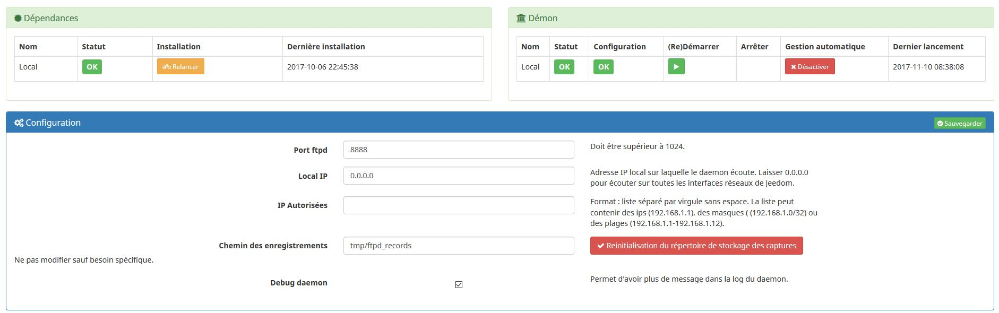
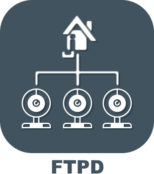

# Description

Ce plugin permet de creer un serveur ftp qui notifiera jeedom lorsqu’un
fichier est déposé. Très utile pour les cameras IP qui peuvent sur
détection de mouvement envoyer un fichier par ftp.

# Market

Retrouvez le sur le [Market](https://www.jeedom.com/market/index.php?v=d&p=market&type=plugin&&name=ftpd) Jeedom

# Prévisualisation

# Forum

Lien vers le [Forum](https://www.jeedom.com/forum/viewtopic.php?p=598482)
